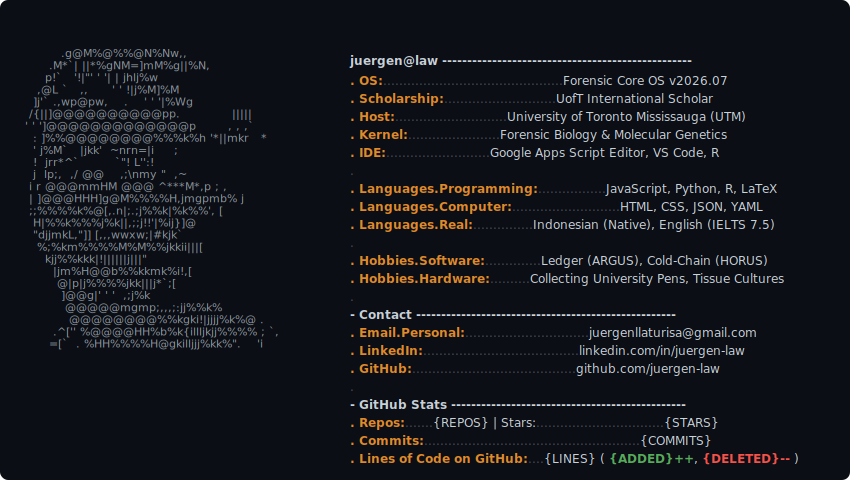

# Hi there, I'm Juergen Law Laturisa 👋

Welcome to my command center. I am an incoming Honours Bachelor of Science student in Forensic Science and Biology at the University of Toronto Mississauga (UTM), as well as an independent software systems developer.

## 💻 My System Console (Real-time Stats)

<picture>
  <source media="(prefers-color-scheme: dark)" srcset="terminal_dark.svg">
  <source media="(prefers-color-scheme: light)" srcset="terminal_dark.svg">
  
</picture>

---

## 🛠️ Key Active Systems

* 🧬 **[Parkinsonia florida Re-Evaluation Study](https://doi.org/10.13140/RG.2.2.24691.28969)** — A published forensic biology paper critiquing the transition from RAPD analysis to codominant molecular markers under modern evidentiary standards.
* 📊 **[ARGUS](https://github.com/juergen-law/ARGUS)** — An automated, self-balancing double-entry accounting engine programmed in Google Sheets with background Apps Script (JavaScript) triggers.
* 🌡️ **[HORUS](https://github.com/juergen-law/HORUS)** — A real-time clinical cold-chain degradation metrics tracking telemetry system built for biological reagent maintenance.

---
*Stats update automatically via daily scheduled GitHub Actions.*
